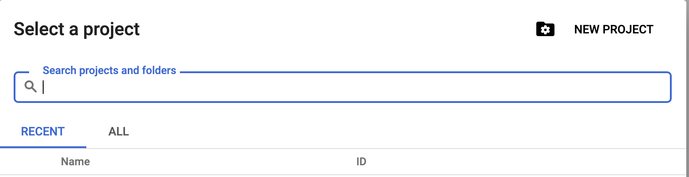
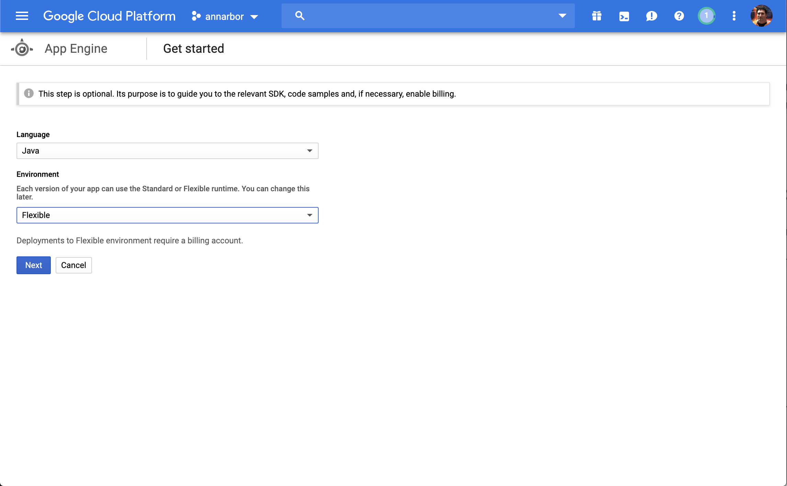
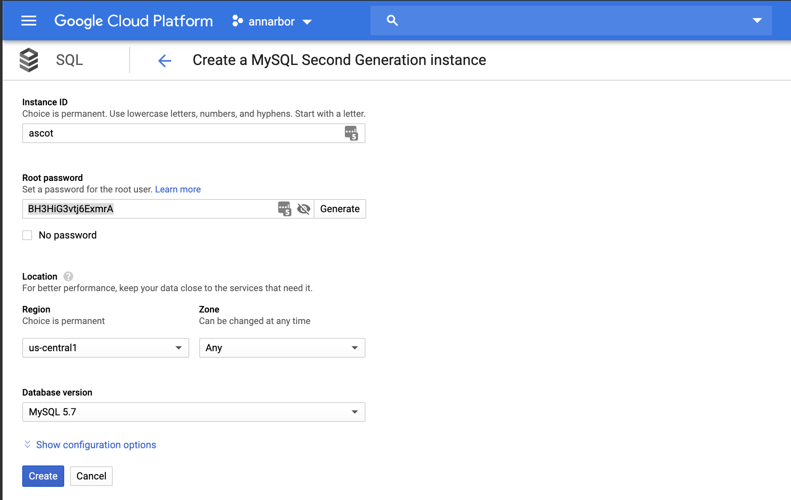
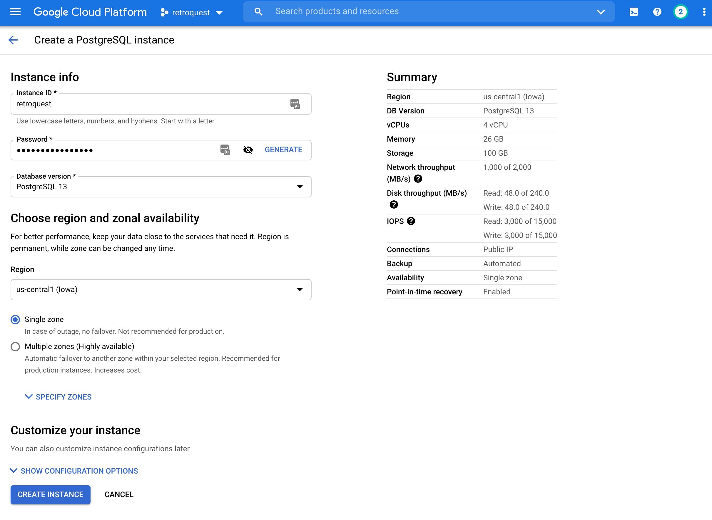

## Setting Up Google Cloud Instance
### Setup Google Project
We recommend using the project ID "retroquest".  If you do this, you will not need to modify the build.gradle file


### App Engine - Create New Project
- Java
- Flexible




### Create New SQL Instance
- MySQL 2nd Gen 5.7
- Create Database





### Enable Cloud SQL Admin API
In order to connect directly to MySQL database from app engine, you need to [Enable the API](https://console.cloud.google.com/flows/enableapi?apiid=sqladmin&redirect=https://console.cloud.google.com&_ga=2.76411670.-2090376866.1552752988)
## Setting up build scripts
### build.gradle
build.gradle needs to point to the project id that you wish to deploy to.  If you did not use "retroquest" as your project ID, then you will need to modify the appengine deploy configuration.
In the example below, we used "annarbor" as the project ID.
```
appengine {
    tools {
        // configure the Cloud Sdk tooling
    }
    stage {
        // configure staging for deployment
    }
    deploy {
        projectId = 'annarbor'
        version = 'initial' + getDateTs()
    }
}
```

### app.yaml
To deploy to google app engine, we will need to create an app.yaml file.  Rename sample.app.yaml in the github repository to app.yaml.

Next, we will need to configure the environment variables for connecting to the database.
```
env_variables:
  SPRING_DATASOURCE_PASSWORD: BH3HiG3vtj6ExmrA
  SPRING_DATASOURCE_URL: jdbc:mysql://google/retroquest?cloudSqlInstance=annarbor:us-central1:ascot&socketFactory=com.google.cloud.sql.mysql.SocketFactory&useSSL=false
  SPRING_DATASOURCE_USERNAME: root
```

Note, in the example above:
- database name: retroquest
- project id: ann arbor
- region: us-central1
- sql instance name: ascot
- The database username has DDL create permissions.  This is necessary for Flyway scripts to create the database tables.
## Deploying
### Authenticate to Google Cloud
`gcloud auth application-default login`
### Deploy Application
`./gradlew appengineDeploy`
