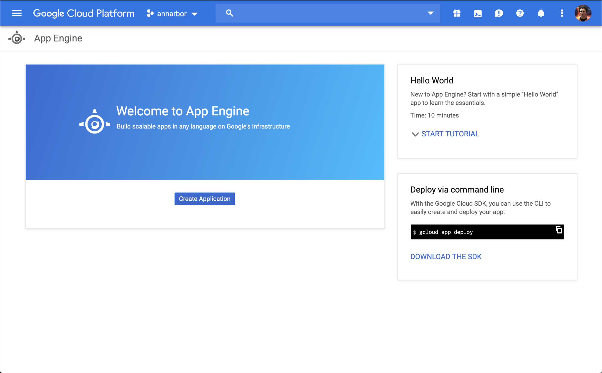

## Setting Up Google Cloud Instance
### Setup Google Project
We recommend using the project ID "retroquest".  If you do this, you will not need to modify the build.gradle file


### App Engine - Create New Project
- Java
- Standard



### Create New SQL Instance
- instance id = retroquest
- PostgreSQL 13
- Create Database


### Enable Cloud SQL Admin API
In order to connect directly to MySQL database from app engine, you need to [Enable the API](https://console.cloud.google.com/flows/enableapi?apiid=sqladmin&redirect=https://console.cloud.google.com&_ga=2.76411670.-2090376866.1552752988)

### Add retroquest user
In Cloud SQL console, navigate to users and choose "Add User Account".
- Choose the PostgreSQL option
- Username retroquest
- enter a secure password of your choosing

### Create Retroquest DB
You need to create the initial instance of the retroquest db.  In the gcloud sdk, enter the following command
```gcloud sql databases create retroquest --instance=retroquest```

## Setting up build scripts
### build.gradle
The build.gradle file is setup such that you will dynamically pass in the project-id and version.

### app.yaml
To deploy to google app engine, we will need to create an app.yaml file.  Rename sample.app.yaml in the github repository to app.yaml.

Next, we will need to configure the environment variables for connecting to the database.
```
env_variables:
  SPRING_DATASOURCE_USERNAME: retroquest
  SPRING_DATASOURCE_PASSWORD: <password>
  SPRING_DATASOURCE_URL: jdbc:postgresql:///retroquest?c<INSTANCE CONNECTION NAME>&socketFactory=com.google.cloud.sql.postgres.SocketFactory
  SPRING_DATASOURCE_NAME: retroquest
```

## Deploying
### Authenticate to Google Cloud
`gcloud auth application-default login`
### Deploy Application
In the example below, we are deploying version 2.0.0 of the application and google assigned a proejctid of retroquest-925256
`./gradlew appEngineDeploy -Dgoogle.app.version=2-0-0 -Dgoogle.app.projectid=retroquest-925256`
