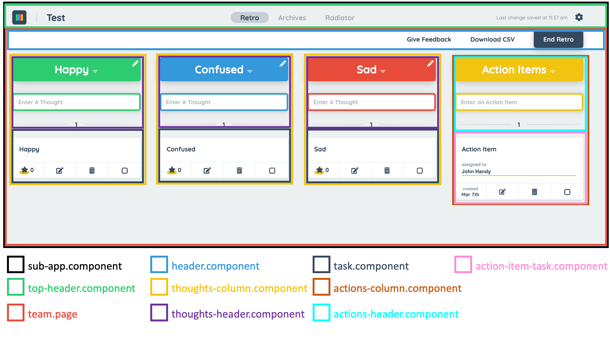

# RetroQuest UI

The RetroQuest UI is developed using the [Angular Framework](https://angular.io/)

## Running Package Scripts

For the purpose of this documentation, we will assume you are using [Yarn Package Manager](https://yarnpkg.com/), but
the commands are very similar using [Node Package manager](https://www.npmjs.com/).

### Starting the Development Server

```
yarn start
```

This command will start the server. Navigate to http://localhost:4200/ to begin interacting on your desktop with the
app. The app will automatically reload if you change any of the source files.

### Testing Strategy
While not perfect, this site makes heavy use of automated testing.  Engineers are encouraged to follow a "test-first" or test driven development approach
to ensure confidence that the application works after a code change is made.  This code base incorporates the following types of testing:
- Unit - confirms that an isolated block of code works properly
- UI - confirms that the user interface behaves as expected when the user interacts with it
- End to End - Simulates a user executing common tasks in a browser

### Unit Testing

This code base uses [Jest](https://jestjs.io/) for its unit testing framework.  Unit test cases are placed alongside src 
files and follow the naming convention *.spec.ts.

```
yarn unit
```

This command will execute the unit tests once and then terminate.

```
yarn unit-watch
```
or
```
yarn test
```

This command will execute all the unit tests and then enter "watch mode" in which case it will execute any tests again where the code has changed.


```
yarn unit-coverage
```

This command will execute the unit tests once and then generate a code coverage report

### UI Testing

This code base uses [Angular Testing Library](https://testing-library.com/docs/angular-testing-library/intro/) to validate 
most UI test cases.  These test cases are run when the unit test cases are run.  Unit test cases are placed alongside src
files and follow the naming convention *.ui.spec.ts.

Jest+Angular Testing Library uses JSDOM to 
simulate a browser.  There are some UI test cases where JSDOM is insufficient to simulat the test scenario in which the UI test 
case is included in the Cypress End to End testing suite.  Instances where it is appropriate to use Cypress instead of Jest:
- Routing
- CSS Style verification

### End to End Testing

This code base uses [Cypress](https://www.cypress.io/) to execute end to end tests as well as UI tests that require a browser to fully simulate.  Cypress tests take much 
longer to run than Jest tests so it is recommended to use them sparingly.

Before starting your cypress tests, you must start the [springboot and angular servers](../README.md#Running-the-Application).

To run end to end tests in headless mode:
```
yarn cypress
```

To run end to end tests in supervised mode:
```
yarn cypress-supervise
```

Note: Some operating systems will require additional libraries to be installed before Cypress can run.  See [Cypress System Requirements](https://docs.cypress.io/guides/getting-started/installing-cypress#System-requirements) 
for more information

### Linting the Code base

```
yarn lint
```

This command will lint the typescript codebase and report violations

```
yarn lint-fix
```

This command will lint the typescript codebase and fix violations

## Angular Components

The UI makes use of Angular components to separate application UI logic. The image below shows a breakdown of the main components in the application.



## Angular Routing

Navigation through RetroQuest is managed by [Angular Router](https://angular.io/guide/router).

| Path                           | Component                          |
| ------------------------------ | ---------------------------------- |
| create                         | CreateComponent                    |
| login                          | LoginComponent                     |
| login/:teamId                  | LoginComponent                     |
| update-password/:teamId        | UpdatePasswordComponent            |
| create-user                    | CreateUserComponent                |
| login-user                     | LoginUserComponent                 |
| user/:user                     | UserViewComponent                  |
| styleguide                     | StyleGuidePageComponent            |
| team/:teamId                   | SubAppComponent, TeamPageComponent |
| team/:teamId/radiator          | ActionsRadiatorViewComponent       |
| team/:teamId/archives          | ArchivesPageComponent              |
| team/:teamId/archives/:boardId | ArchivedBoardPageComponent         |
